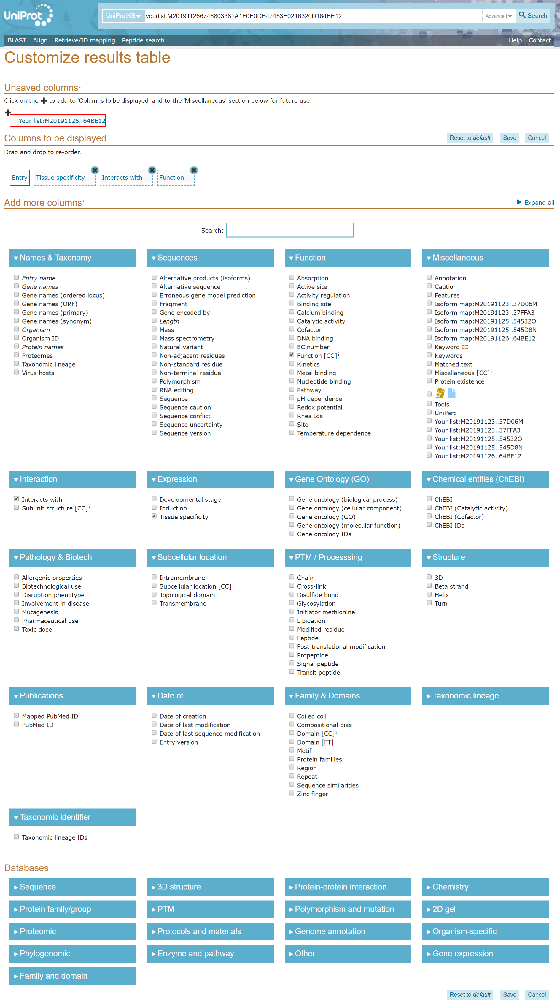
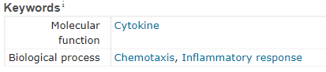
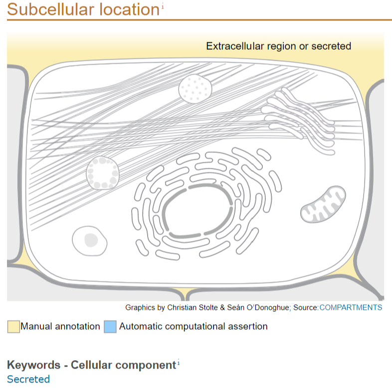

\newpage

```{r setup, include=FALSE}
rm(list=ls())
knitr::opts_chunk$set(echo = TRUE)
library(sqldf)
library(tidyverse)
library(knitr)
library(kableExtra)
library(stringr)
library(rvest)
```

# GitHub Project Information
All of the files referenced here are located in this GitHub repository: https://github.com/anniegbryant/DA5020_Final_Project. This includes the R source code, Rmd file used to generate this report, R environment data, and .csv input and output.

# Project Overview

For my final project, I chose to curate a database of protein-specific information acquired from the UniProt Knowledge Base^1^. I wanted the R script to read in a list of UniProt IDs from a CSV file and output R and SQL dataframes containing relevant information corresponding to each UniProt entry, including molecular function, biological process, Reactome pathway, and disease involvement. This involves querying the UniProt webpage for each ID using rvest^2^, cleaning the data within R using dplyr^3^, and organizing the data into a SQL database with normalized tables using sqldf^4^.  

My motivation for this project comes from my work as a Research Technician in the lab of Dr. Brad Hyman at Massachusetts General Hospital. I joined a project over the summer in which plasma samples were collected from cognitively impaired patients at two or three time points over several years to measure protein expression. Specifically, expression levels for 414 different proteins were measured using a highly-sensitive transcription-based amplification technology from Olink Proteomics, yielding normalized relative protein expression values for each plasma sample. In total, for 414 proteins and 123 patients with plasma from multiple time points (2 or 3), this data amounts to 145,314 data points. One predominant goal of this project is to identify biomarkers that either predict or correlate with cognitive decline, since both protein expression and cognitive status were measured at each visit for each patient.

Multiple groups in the lab are analyzing this resulting dataset with other various goals, focusing on different subsets of the 414 proteins assayed. My group is particularly interested in the dynamics of cerebral vasculature with AD pathogenesis and progression^5^. As such, we have focused on a smaller subset of 21 vasculature-related proteins. I came across the R package Time-course Gene Set Analysis (TcGSA) package which is designed to analyze longitudinal RNA-Seq data by grouping individual genes into gene sets, *a priori*, which are known to share common biological functions and/or expression patterns^6^. While I wasn't able to get this package to work with my protein data, it inspired me to approach our longitudinal protein expression data analysis from a similar perspective. 

I realized it would be tremendously helpful to have functional information about each protein in addition to the expression data, in order to potentially identify overarching trends in protein networks.Hopefully, the SQL database created in this project will provide further insight into the relationship between protein expression change and cognitive decline going forward.  


# About the UniProt Data Involved

In this longitudinal study, expression levels were measured for 414 different proteins. One particularly useful collection of information I used comes from the **Gene Ontology**^7,8^, which is an online consortium integrating structural and functional information about genes and gene products from numerous sources. I used UniProt's Retrieve/ID Mapping tool to download the following information about each of these proteins:  


* **Gene Ontology (GO) Biological Process**: Broader biological processes achieved via several molecular activities, from DNA repair to lipid transporter activity.
* **Gene Ontology Cellular Component**: Intracellular component(s) in which a gene product executes a particular function -- for example, ribosome or Golgi apparatus.
* **Gene Ontology Molecular Function**: Activities performed at the molecular level by one or more gene products, including transporter activity and Toll-like receptor binding.
* **Tissue specificity**: Organ(s) or organ system(s) in which the protein is expressed throughout the body.
* **Function overview**: Higher-level information about the general function(s) of the protein.
* **KEGG ID**: ID linking the UniProt entry to the corrresponding entry in the Kyoto Encyclopedia of Genes and Genomes (KEGG)^9,10,11^


To hone in on specific information I wanted, I also used rvest to scrape the following information about each protein:   

* **Biological Process keyword**: One or two primary GO biological processes.
* **Molecular Function keyword**: One or two primary GO molecular functions. 
* **Associated diseases**: Any disease(s) associated with genetic variations in the protein.
* **Subcellular location**: The location and the topology of the mature protein in the cell.
* **Reactome Pathway**: The ID and description associated with a Reactome Pathway, an expansive collection of biological pathways and processes.^12^  


# Method Selection

I downloaded some data directly from the UniProt batch download tool, and any data I couldn't download in CSV format, I extracted via web scraping.  For the web scraping, I chose to use rvest over other scraping tools we covered this semester (e.g. import.io) since I wanted to access 414 different webpages programmatically, an application for which rvest is well-suited. By adding an 0.5s delay between webpage queries, I avoided bombarding the UniProt server without exponentially increasing the code runtime. I opted to load each UniProt webpage and read its HTML contents just once, and then apply helper functions to extract the desired information (e.g. GO keyword, subcellular location) from each page once loaded. Each helper function takes in a UniProt page upon which read_html() has been called, and extracts the pertinent information to save into a dataframe. 

I prefer to work with the dataframes in dplyr before adding them to SQL data tables. Therefore, once all of the UniProt data was extracted via CSV download or web scrape, I used dplyr to clean the data. The biggest issue with the preliminary dataset was that many cells contained multiple values, separated by delimiters such as commas, periods, or semi-colon. I chose to split these values into separate rows, yielding two- or three-column dataframes, with the UniProt ID in one column and the data value(s) in the other column(s). This meant my dataframes were largely in long format, which I anticipate will be more conducive for my downstream analysis involving grouping proteins by function or pathway. Once the data was cleaned, I used sqldf to add the dataframes to the SQLite connection which can then be queried in RStudio with dbGetQuery() commands.

# Issues Encountered  

I went through several iterations of my R code. My first approach was to use self-contained functions to download the HTML contents of each UniProt page for each value I wanted to extract, instead of downloading the content once and passing in helper functions. For example, I originally wrote the following two functions that separately extracted the GO Keywords and Reactome Pathways from UniProt pages that were downloaded twice, which is redunant and takes far longer:

```{r}
# Extract GO Keywords
extract_keywords <- function(id) {
  #Sleep for 0.5s between requests to not overload Uniprot server
  Sys.sleep(0.5)
  
  #Create temporary dataframe to store this page's data
  page <- data.frame(X1="NA", X2="NA", Uniprot_ID=id)
  
  #Try the given URL and return NA if there is a 404 error
  try(
    page <- sprintf(uniprot_url, URLencode(id)) %>%
      read_html() %>%
      #Keywords are contained in the first databaseTable
      html_node(".databaseTable") %>%
      #Convert to table (dataframe)
      html_table() %>%
      #Add Uniprot ID
      mutate(Uniprot_ID = id),
    silent=TRUE
  )
  #Append to dataframe
  all_keywords <- rbind(all_keywords, page)
}

# Extract Reactome Pathway
extract_pathway <- function(id) {
  #Sleep for 0.5s between requests to not overload Uniprot server
  Sys.sleep(0.5)
  
  #Create temporary dataframe to store this page's data
  path <- data.frame(Uniprot_ID=id, .="NA")
  
  try(
    path <- sprintf(uniprot_url, URLencode(id)) %>%
      read_html() %>%
      html_nodes(".databaseTable :contains(ReactomeiR)") %>%
      html_text() %>%
      .[2] %>%
      as.data.frame(.) %>%
      mutate(Uniprot_ID=id),
    silent=TRUE
  )
  rc_path <- rbind(rc_path, path)
}
```

Once I realized this redundancy and instead wrote individual helper functions and one larger function to download the HTML content, it was easy to tweak the helper functions to get exactly the format of the content I wanted. It was also easier to download all the content in one go, and then once the data was downloaded and stored in dataframes, to clean and organize the data using dplyr afterward.


# Summary of Data Collected

In total, I have compiled eleven distinct data tables that encompass protein function, cellular location, and protein pathways for the 414 proteins in our study. More specifically, I have amassed the following distinct counts of values across the respective tables:  

* Biological Process, Keywords: 81
* Biological Process, Full: 2825
* Cellular Compartment, Full: 335
* Disease Associations: 200
* Function overview: 1763
* Molecular Function, Keywords: 67
* Molecular Function, Full: 580
* Subcellular Location: 41
* Reactome Pathway: 583
* Tissue Specificity: 638
* KEGG IDs: 414

# Future Implementations

As described, the purpose for this project is to obtain more information about the proteins studied in the longitudinal Alzheimer's Disease plasma study so that we can examine trends among protein pathways and across functional domains. While I cannot share any of the actual data or analysis for this project due to confidentiality, I am excited about how these datasets will facilitate new discoveries for our project going forward. I have thus far only focused on acquiring and organizing the data, as per the project guidelines, but the next phase of project implementation will be to perform statistical analyses (e.g. T-Tests, Logistic Regression, PCA) with biological process and Reactome pathway as categorical variables.  


# References

1. UniProt Consortium. (2018). UniProt: a worldwide hub of protein knowledge. Nucleic acids research, 47(D1), D506-D515.
2. Hadley Wickham (2019). rvest: Easily Harvest (Scrape) Web Pages. R package version 0.3.5. https://CRAN.R-project.org/package=rvest
3. Hadley Wickham, Romain François, Lionel Henry and Kirill Müller (2018). dplyr: A Grammar of Data Manipulation. R package version 0.7.6. https://CRAN.R-project.org/package=dplyr
4. G. Grothendieck (2017). sqldf: Manipulate R Data Frames Using SQL. R package version 0.4-11. https://CRAN.R-project.org/package=sqldf
5. Bennett, R. E., Robbins, A. B., Hu, M., Cao, X., Betensky, R. A., Clark, T., ... & Hyman, B. T. (2018). Tau induces blood vessel abnormalities and angiogenesis-related gene expression in P301L transgenic mice and human Alzheimer’s disease. Proceedings of the National Academy of Sciences, 115(6), E1289-E1298.
6. Hejblum BP, Skinner J, and Thiebaut R (2015) Time-Course Gene Set Analysis for Longitudinal Gene Expression Data. PLoS Comput Biol 11(6): e1004310.<doi:10.1371/journal.pcbi.1004310
7. Ashburner et al. Gene ontology: tool for the unification of biology. Nat Genet. May 2000;25(1):25-9.
8. The Gene Ontology Consortium. The Gene Ontology Resource: 20 years and still GOing strong. Nucleic Acids Res. Jan 2019;47(D1):D330-D338. 
9. Kanehisa, M. and Goto, S.; KEGG: Kyoto Encyclopedia of Genes and Genomes. Nucleic Acids Res. 28, 27-30 (2000). 
10. Kanehisa, M., Sato, Y., Furumichi, M., Morishima, K., and Tanabe, M.; New approach for understanding genome variations in KEGG. Nucleic Acids Res. 47, D590-D595 (2019).
11. Kanehisa, M; Toward understanding the origin and evolution of cellular organisms. Protein Sci. (2019)
12. Fabregat, A., Jupe, S., Matthews, L., Sidiropoulos, K., Gillespie, M., Garapati, P., ... & Milacic, M. (2017). The reactome pathway knowledgebase. Nucleic acids research, 46(D1), D649-D655.


# Appendix: Methods and Figures


# Methods

I first explored UniProt's Retrieve/ID Mapping tool (https://www.uniprot.org/uploadlists/) to see what information I could download for a given list of UniProt IDs. The tool allows a user to enter a list of UniProt IDs or upload a file containing IDs, after which the user can select which column(s) they wish to download corresponding to each UniProt ID entry.

```{r, echo=FALSE, out.height = "450px"}

```

&nbsp;

I opted to download the Gene Ontology (GO) Biological Process, GO Cellular Component, GO Molecular Function, Function overview, Reactome ID, and KEGG ID. This downloaded file is available in the GitHub project as UniProt_download.csv.

```{r, warning=F, message=F, results='hide'}
UP_df <- read.csv("UniProt_download.csv", stringsAsFactors = F)
colnames(UP_df)[1] <- "UniProt_ID"
```


Here is an excerpt of this dataset:

```{r, echo=F}

knitr::kable(head(UP_df, n=5) %>%
  rowwise() %>%
  mutate_if(is.character, str_trunc, width = 15, ellipsis = ''), 
  format="latex", booktabs=T) %>%
  kable_styling(latex_options="scale_down")
  
```


I then normalized this dataset by breaking it up into several subsets, each in long format with one value per row and (potentially) multiple rows per UniProt ID.  

First, I created a **Tissue_specificity** tibble to store UniProt IDs and the corresponding tissue(s) in which the protein is typically present. Some proteins are expressed in multiple sets of tissue systems, the names of which were all concatenated in one value. To simplify for downstream analysis, I split the string strings by the [.] delimiter and stored separate entries in different rows, such that one UniProt ID may be listed in several rows corresponding to different tissues.

```{r}
Tissue_specificity <- UP_df %>%
  select(UniProt_ID, Tissue_specificity) %>%
  mutate(Tissue_specificity = str_replace_all(Tissue_specificity, "[(]PubMed:.*[)]", "")) %>%
  filter(str_detect(Tissue_specificity, "ECO", negate=T), 
         Tissue_specificity != "") %>% 
  na.omit()
```

```{r, echo=F}
knitr::kable(head(Tissue_specificity, n=10) %>%
  rowwise() %>%
  mutate_if(is.character, str_trunc, width = 100), 
  format="latex", booktabs=T) %>%
  kable_styling(latex_options="scale_down")
```

I created a **Function_overview** tibble to store each sentence in the protein's general function overview as a separate row.

```{r}
# Table for Function_overview
Function_overview <- UP_df %>%  
  select(UniProt_ID, Function) %>%  
  mutate(Function = str_split(Function, "[.] ")) %>%  
  unnest(Function) %>%  
  mutate(Function = str_replace_all(Function, "[(]PubMed:.*[)]", "")) %>%  
  filter(Function != "") %>%  
  filter(str_detect(Function, "ECO", negate=T),
         Function != "")
```
```{r, echo=F}
kable(head(Function_overview, n=5), format="latex", booktabs=T) %>%  
  kable_styling(latex_options="scale_down")
```

Lastly, I created a table linking UniProt IDs with the corresponding KEGG ID so I can later extract information from the Kyoto Encyclopedia of Genes and Genomes (KEGG, https://www.genome.jp/kegg/).
```{r}
# Table for KEGG IDs
UniProt_KEGG <- UP_df %>%  
  select(UniProt_ID, KEGG_ID)  
```
```{r, echo=F}

kable(head(UniProt_KEGG, n=5), format="latex", booktabs=T)
```

&nbsp;
&nbsp;

I created separate dataframes for the BP, CC, and MF. As with other dataframes, I split multiple values from one string into multiple rows per UniProt ID.

**Biological Process:**
```{r}
# Table for all Gene Ontology Biological Processes
GO_BP_Full <- UP_df %>%
  select(UniProt_ID, GO_BP) %>%  
  mutate(GO_BP = str_split(GO_BP, "; ")) %>%  
  unnest(GO_BP) %>%  
  filter(GO_BP != "") %>%  
  separate(GO_BP, into=c("Biological_process", "GO_ID"), sep=" \\[") %>%  
  mutate(GO_ID = str_replace(GO_ID, "\\]", ""))
```
```{r, echo=F}

kable(head(GO_BP_Full, n=5), format="latex", booktabs=T)
```

&nbsp;
&nbsp;

**Cellular Components:**
```{r}
# Table for all Gene Ontology Cellular Components
GO_CC_Full <- UP_df %>%
  select(UniProt_ID, GO_CC) %>%  
  mutate(GO_CC = str_split(GO_CC, "; ")) %>%  
  unnest(GO_CC) %>%  
  filter(GO_CC != "") %>%  
  separate(GO_CC, into=c("Cellular_component", "GO_ID"), sep=" \\[") %>%  
  mutate(GO_ID = str_replace(GO_ID, "\\]", ""))
```
```{r, echo=F}

kable(head(GO_CC_Full, n=5), format="latex", booktabs=T)
```

&nbsp;
&nbsp;

**Molecular Functions:**

```{r}
# Table for all Gene Ontology Molecular Functions
GO_MF_Full <- UP_df %>%  
  select(UniProt_ID, GO_MF) %>%  
  mutate(GO_MF = str_split(GO_MF, "; ")) %>%  
  unnest(GO_MF) %>%  
  filter(GO_MF != "") %>%  
  separate(GO_MF, into=c("Molecular_function", "GO_ID"), sep=" \\[") %>%  
  mutate(GO_ID = str_replace(GO_ID, "\\]", ""))
```
```{r, echo=F}

kable(head(GO_MF_Full, n=5), format="latex", booktabs=T)

```

&nbsp;

This dataset contains exhaustive information about the functions, interactions, and localized expression of each protein in the list. However, given the large number of proteins in our study (n=414), I thought it would be beneficial to acquire more succinct information about primary functions and locations of the proteins. This would enable a simpler first-pass analysis to identify relevant protein functions and pathways, which I could then examine in greater detail. I visited the UniProt page for the first protein in the list, with ID O00175, to identify potential information that could serve this purpose.  

I noticed that there is a "Keywords” section, with a succinct list of one or two primary Biological Processes and Molecular Functions per protein:

```{r, echo=FALSE, out.width = "475px"}

```

These keywords are manually selected by UniProt database curators from the UniProtKB to reflect the primary one or two biological processes and molecular functions in which a particular protein participates.

There is also a Keywords sections for Subcellular location:
```{r, echo=F, out.width = "300px"}

```  

The UniProt page also includes any noted disease associations with the given protein:
```{r, echo=F, out.width="475px"}
knitr::include_graphics("Report_images/disease.png")
```

My next step would thus be to scrape the Keywords, Subcellular Location, and any Disease Associations for each protein in the list. I loaded a CSV file containing the protein names and UniProt IDs included in the longitudinal study.

```{r, message=F}

# Load UniProt IDs and protein names
proteins <- read.csv("Protein_UniProt_List.csv")

# Create matrix of UniProt_IDs
UniProt_IDs <- as.matrix(proteins$Uniprot_ID)
```

The base URL for any UniProt protein query is https://www.uniprot.org/uniprot/.
```{r}
uniprot_url <- "https://www.uniprot.org/uniprot/%s"
```

To reduce computation time and minimize queries sent to UniProt, I chose to load each webpage and read its contents just once, and then apply helper functions to extract the desired information from each page once loaded. Each helper function below takes in a UniProt page upon which read_html() has been called, and extracts the pertinent information to save into a dataframe.


**GO Keywords**:
```{r}
# Function to extract keywords from UniProt page for a given UniProt ID
extract_keywords <- function(page) {
  page %>%
      #Keywords are contained in the first databaseTable
      html_node(".databaseTable") %>%
      #Convert to table (dataframe)
      html_table()
}
```

**Disease Associations**:
```{r}
# Function to extract diseases from UniProt page for a given UniProt ID
extract_diseases <- function(page) {
  page %>%
    html_node(".diseaseAnnotation") %>%  
    html_nodes(xpath="//a[contains(@href, '/diseases/')]") %>%  
    html_text() %>%  
    as.data.frame() 
}
```

**Subcellular location:**
```{r}
# Function to extract subcellular location
extract_location <- function(page) {
  page %>%
    html_nodes(xpath="//*[@class='namespace-uniprot']/
               main[@id='content']/
               div[@class='main-aside']/
               div[@class='content entry_view_content up_entry swissprot']/
               div[@id='subcellular_location']/
               span/a") %>%  
    html_text() %>%
    as.data.frame()
}
```

**Reactome Pathway:**
```{r}
# Function to extract pathway
extract_pathway <- function(page) {
  page %>%
    html_nodes(".databaseTable :contains(ReactomeiR)") %>%  
    html_text() %>%  
    # Only keep the second text entry
    .[2] %>%  
    as.data.frame()
}
```


Initialize empty dataframes to append results from helper functions:
```{r}
# Initialize empty dataframes
keyword_df <- data.frame(X1=character(0), X2=character(0), 
                         UniProt_ID=character(0))
disease_df <- location_df <- pathway_df <- data.frame(.=character(0), 
                                                      UniProt_ID=character(0))
```

Extract_all is the function which will load a UniProt URL, read and parse the associated html content, and call each of the helper functions to extract all of the desired information.

```{r}
# Given a UniProt ID, apply all the above functions to extract relevant info
extract_all <- function(id) {
  Sys.sleep(0.5)
  
  #Try the given URL and return NA if there is a 404 error
  try(
    page <- sprintf(uniprot_url, URLencode(id)) %>%
      read_html(),
    silent=T
  )
  
  # Keywords
  kw <- extract_keywords(page) %>%
    mutate(UniProt_ID = id) %>%
    distinct()
  keyword_df <<- rbind(keyword_df, kw)
  
  # Associated diseases
  disease <- extract_diseases(page) %>%
    mutate(UniProt_ID = id) %>%
    distinct()
  disease_df <<- rbind(disease_df, disease)
  
  # Subcellular location
  location <- extract_location(page) %>%
    mutate(UniProt_ID = id) %>%
    distinct()
  location_df <<- rbind(location_df, location)
  
  # Pathway
  pathway <- extract_pathway(page) %>%
    mutate(UniProt_ID = id) %>%
    distinct()
  pathway_df <<- rbind(pathway_df, pathway)
}
```

I then apply extract_all to each row in the 414x1 matrix containing the UniProt IDs.
```{r, message=F, warning=F, results='hide'}
# Calling invisible() to suppress console output
invisible(apply(UniProt_IDs, 1, extract_all))
```


Once the data is collected in individual dataframes, I then cleaned them using dplyr. I first renamed the columns in location_df and disease_df.

```{r}
# Rename DF columnes
colnames(location_df) <- c("Subcellular_location", "UniProt_ID")
colnames(disease_df) <- c("Disease_association", "UniProt_ID")
```


Then I reorganized the keywords dataframe into separate Biological Process and Molecular Function dataframes.

```{r}
# Create dataframe to hold Biological Process and Molecular Function
BP_MF <- keyword_df %>%  
  # Only interested in Biological Process or 
  # Molecular Function keywords  
  filter(str_detect(X1, 
                    "<p>|Ligand|Reactome|SABIO-RK|SignaLink|SIGNOR|MEROPS|Error", 
                    negate=T)) %>%
  spread(key=X1, value=X2)

```

To better organize rows with multiple values in one column, I split BP_MF into two dataframes, one for BP and one for MF.
```{r}
# Create one dataframe for biological processes
BP <- BP_MF %>%
  select(UniProt_ID, `Biological process`) %>%  
  rename(Biological_Process = `Biological process`) %>%  
  mutate(Biological_Process = str_split(Biological_Process, ", ")) %>%  
  unnest(Biological_Process) %>%
  na.omit()

# Create one dataframe for molecular functions
MF <- BP_MF %>%
  select(UniProt_ID, `Molecular function`) %>%  
  rename(Molecular_Function = `Molecular function`) %>%  
  mutate(Molecular_Function = str_split(Molecular_Function, ", ")) %>%  
  unnest(Molecular_Function) %>%  
  na.omit()

```

The pathways dataframe contains multiple values in the Path column, all as one string. I split them by the "R-HSA-" delimiter and store distinct R-HSA pathway entries as separate rows.
```{r}
# Many UniProt proteins are mapped to several Reactome Pathways,
# This code splits multiple pathway entries into distinct rows
colnames(pathway_df) <- c("Path", "UniProt_ID")
pathway_df <- pathway_df %>%
  rowwise() %>%  
  mutate(Path = str_replace(Path, "Reactomei", "")) %>%  
  # Split by the R-HSA- string
  mutate(Path= str_split(Path, "R-HSA-", n=Inf)) %>%  
  
  # Un-list
  unnest(Path) %>%  
  
  # Remove empty strings that reflect non-existent pathways
  filter(Path != "") %>%  
  
  # Split into R-HSA IDs and pathway descriptions
  mutate(Path = str_split(Path, " ", n=2)) %>%  
  purrr::quietly(unnest_wider)(Path) %>%
  
  # only keep Results of purrr::quietly()
  .[[1]] %>%  
  rowwise() %>%  
  mutate(`...1` = paste("R-HSA-", `...1`, sep="", collapse=""))

colnames(pathway_df) <- c("Reactome_ID", "Pathway_Description", "UniProt_ID")
```


Here are snippets of the cleaned web-scraped dataframes:

**Biological Process**
```{r, echo=F}
kable(head(BP, n=5), format="latex", booktabs=T)
```

&nbsp;

**Molecular Function**
```{r, echo=F}
kable(head(MF, n=5), format="latex", booktabs=T)
```
&nbsp;


**Disease Associations**
```{r, echo=F}
kable(head(disease_df, n=5), format="latex", booktabs=T)
```
&nbsp;


**Subcellular Location**
```{r, echo=F}
kable(head(location_df, n=5), format="latex", booktabs=T)
```
&nbsp;


**Reactome Pathways**
```{r, echo=F}
kable(head(pathway_df, n=5), format="latex", booktabs=T)
```

&nbsp;

Each of these cleaned dataframes is available in the GitHub project as a .csv file in the CSV Files folder.  


Lastly, I used sqldf to add the dataframes to a SQL database.

```{r, message=F, warning=F}
# Connect to SQLite
db <- dbConnect(SQLite(), dbname="UniProt.sqlite")

dbWriteTable(conn = db, name = "Biological_Process", value=BP, 
             row.names=FALSE, header=TRUE, overwrite=T)

dbWriteTable(conn = db, name = "Biological_Process_Full", value=GO_BP_Full,  
             row.names=F, header=T, overwrite=T)

dbWriteTable(conn = db, name = "Cellular_Component_Full", value=GO_CC_Full,  
             row.names=F, header=T, overwrite=T)

dbWriteTable(conn = db, name = "Disease_Associations", value=disease_df,   
             row.names=FALSE, header=TRUE, overwrite=T)

dbWriteTable(conn = db, name = "Function_Overview", value=Function_overview,   
             row.names=FALSE, header=TRUE, overwrite=T)  

dbWriteTable(conn = db, name = "Molecular_Function", value=MF,   
             row.names=FALSE, header=TRUE, overwrite=T)

dbWriteTable(conn = db, name = "Molecular_Function_Full", value=GO_MF_Full, 
             row.names=F, header=T, overwrite=T)

dbWriteTable(conn = db, name = "Protein_Names", value = proteins,   
             row.names = FALSE, header = TRUE, overwrite=T)

dbWriteTable(conn = db, name = "Pathways", value=pathway_df,   
             row.names=FALSE, header=TRUE, overwrite=T)

dbWriteTable(conn = db, name = "Subcellular_Location", value=location_df,   
             row.names=FALSE, header=TRUE, overwrite=T)

dbWriteTable(conn = db, name = "Tissue_Specificity", value=Tissue_specificity,  
             row.names=F, header=T, overwrite=T)

dbWriteTable(conn = db, name = "KEGG_IDs", value=UniProt_KEGG,   
             row.names=F, header=T, overwrite=T)

```


To confirm the tables were successfully added to the SQL database, I can call dbListTables() on the database:

```{r}
dbListTables(db)
```

# Results

In total, I have compiled eleven distinct data tables that encompass protein function, cellular location, and protein pathways for the 414 proteins in our study. More specifically, I have amassed the following distinct counts of values across the respective tables:  

* Biological Process, Keywords: 81
* Biological Process, Full: 2825
* Cellular Compartment, Full: 335
* Disease Associations: 200
* Function overview: 1763
* Molecular Function, Keywords: 67
* Molecular Function, Full: 580
* Subcellular Location: 41
* Reactome Pathway: 583
* Tissue Specificity: 638
* KEGG IDs: 414


To demonstrate the efficacy of accessing data from the SQL database, I queried the most frequent values from some of the data tables.


## Biological Process Keywords:

```{r}
BP_Count <- dbGetQuery(db, "SELECT Biological_Process, COUNT(*) AS 'Count'
           FROM Biological_Process
           GROUP BY Biological_Process
           ORDER BY COUNT(*) DESC")
```


```{r, echo=F}
kable(head(BP_Count, n=10), format="latex", booktabs=T)
```

## Biological Process, Full:
```{r}
BP_Full_Count <- dbGetQuery(db, "SELECT Biological_process, COUNT(*) AS 'Count'
                            FROM Biological_Process_Full
                            GROUP BY Biological_process
                            ORDER BY COUNT(*) DESC")
```

```{r, echo=F}
kable(head(BP_Full_Count, n=10), format="latex", booktabs=T)
```


## Molecular Function Keywords:


```{r}
MF_Count <- dbGetQuery(db, "SELECT Molecular_Function, COUNT(*) as 'Count' 
           FROM Molecular_Function
           GROUP BY Molecular_Function
           ORDER BY COUNT(*) DESC")
```

```{r, echo=F}
kable(head(MF_Count, n=10), format="latex", booktabs=T)
```


## Molecular Function, Full:

```{r}
MF_Full_Count <- dbGetQuery(db, "SELECT Molecular_function, COUNT(*) as 'Count' 
           FROM Molecular_Function_Full
           GROUP BY Molecular_function
           ORDER BY COUNT(*) DESC")

```

```{r, echo=F}
kable(head(MF_Full_Count, n=10), format="latex", booktabs=T)
```


## Disease Association:

```{r}
DS_Count <- dbGetQuery(db, "SELECT Disease_association, COUNT(*) as 'Count'
            FROM Disease_Associations
            GROUP BY Disease_association
            ORDER BY COUNT(*) DESC")
```

```{r, echo=F}
kable(head(DS_Count, n=5), format="latex", booktabs=T)
```

## Function Overview:


```{r}
FO_Count <- dbGetQuery(db, "SELECT Function, COUNT(*) as 'Count'
            FROM Function_Overview
            GROUP BY Function
            ORDER BY COUNT(*) DESC")
```

```{r, echo=F}
kable(head(FO_Count, n=10), format="latex", booktabs=T) %>%
  kable_styling(latex_options="scale_down")
```

## Subcellular Location:

```{r}
LC_Count <- dbGetQuery(db, "SELECT Subcellular_location AS 'Subcellular Location', 
            COUNT(*) as 'Count'
            FROM Subcellular_Location
            GROUP BY Subcellular_location
            ORDER BY COUNT(*) DESC")
```

```{r, echo=F}
kable(head(LC_Count, n=10), format="latex", booktabs=T)
```

## Cellular Compartment, Full:

```{r}
CC_Full_Count <- dbGetQuery(db, "SELECT Cellular_component, COUNT(*) as 'Count'
            FROM Cellular_Component_Full
            GROUP BY Cellular_component
            ORDER BY COUNT(*) DESC")
```

```{r, echo=F}
kable(head(CC_Full_Count, n=10), format="latex", booktabs=T)
```


## Reactome Pathways:


```{r}
PT_Count <- dbGetQuery(db, "SELECT Reactome_ID, 
            Pathway_Description AS 'Pathway Description', COUNT(*) as 'Count'
            FROM Pathways
            GROUP BY Reactome_ID
            ORDER BY COUNT(*) DESC")
```

```{r, echo=F}
kable(head(PT_Count, n=10), format="latex", booktabs=T) %>%
  kable_styling(latex_options="scale_down")
```


